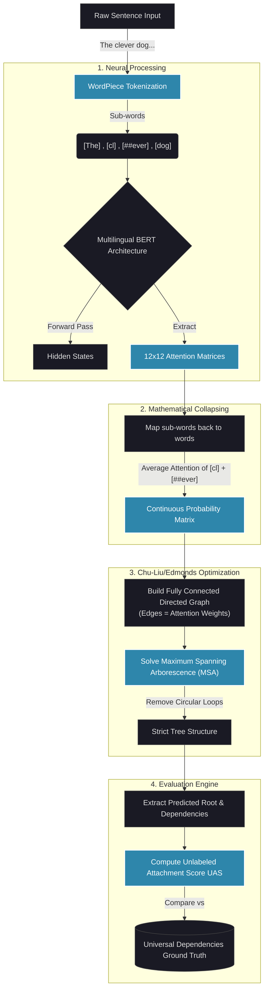

# BERT Attention to Dependency Website

This project converts an exploratory notebook that extracts BERT attention to reconstruct syntactic dependency parsing paths into a robust, high-performance web application. Built with FastAPI for backend agility and Vanilla Javascript + D3.js + Glassmorphism aesthetics for modern presentation.

## Prerequisites

- Python 3.10+
- `pip` package manager

## How to Run Locally

1. **Install Dependencies**
   In the root of the project, navigate to the backend directory and install the necessary requirements:
   ```bash
   pip install -r backend/requirements.txt
   ```
2. **Setup Datasets**
   We extract sentences from the full Huggingface `universal_dependencies` dataset, splitting them 70% for train and 30% for test. Run:
   ```bash
   python backend/extract_ud_data.py
   ```
   *This populates `backend/data` with subset `.json` files.*

3. **Run Language Analysis**
   Discover specialist heads from the 70% training split:
   ```bash
   python backend/run_lang_analysis.py
   ```

4. **Run Evaluation**
   Evaluate the model on the 30% held-out test split:
   ```bash
   python backend/run_evaluation.py
   ```

5. **Start the FastAPI Server**
   Start the backend (which also serves the frontend):
   ```bash
   python -m uvicorn backend.main:app --reload
   ```

6. **Access the App**
   Open your browser and navigate to `http://localhost:8000`. The frontend will be served directly! You can also view the autogenerated API docs at `http://localhost:8000/docs`.

## How the Algorithm Works

When a sentence like **"The clever dog..."** is passed through the pipeline, the following exact sequence occurs under the hood to reconstruct grammar purely from neural attention patterns:



### Code Structure
- `/backend`: Hosts `main.py` routing, `model_loader.py` for optimal transformers initialization, `data_loader.py` to stream JSON pool, and `nlp_utils.py` containing Chu-Liu/Edmonds.
- `/frontend`: Responsive glassmorphic layout, using `tree.js` wrapped around D3.js to bring tree-visualization inline.

## Architecture Highlights
- **Singleton Model Loading**: Large Transformer models are loaded once during `lifespan` startup, significantly decreasing request latency.
- **D3.js Visualization**: Provides interactive DAG representations of both predicted dependencies and Gold standard targets natively inline.
